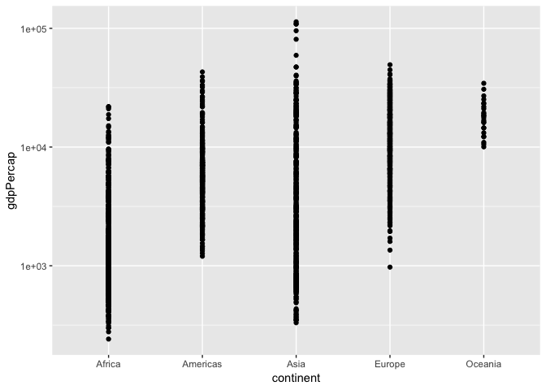
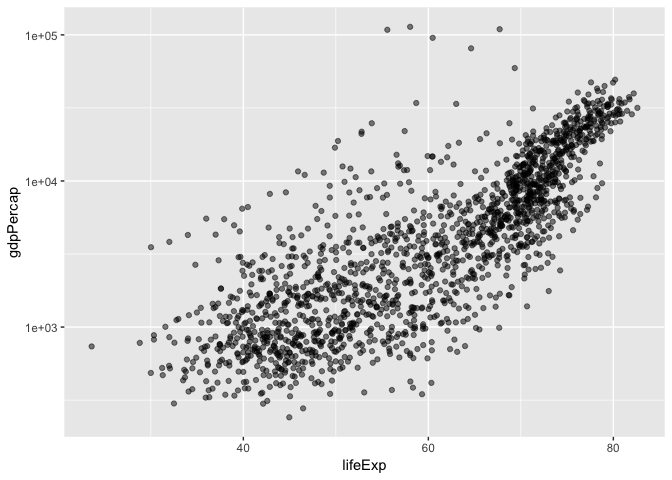
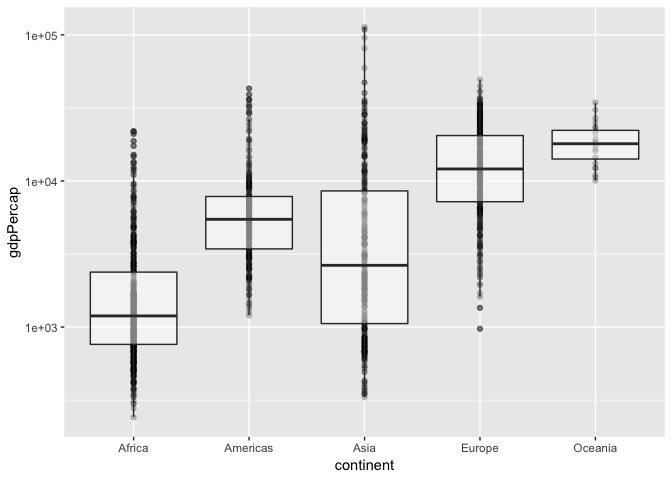
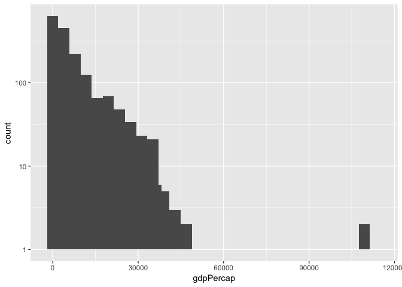
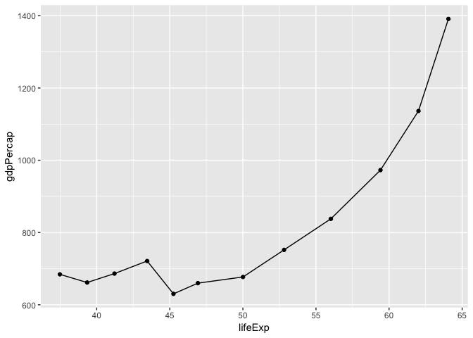
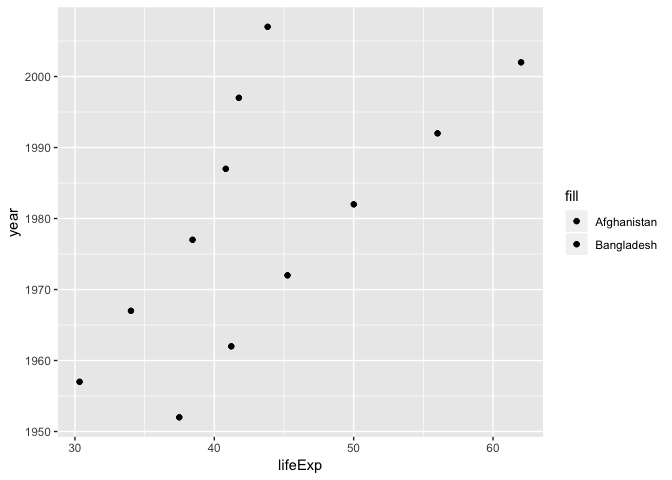
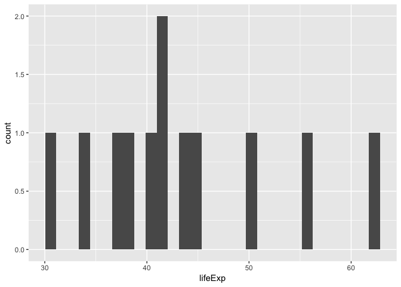
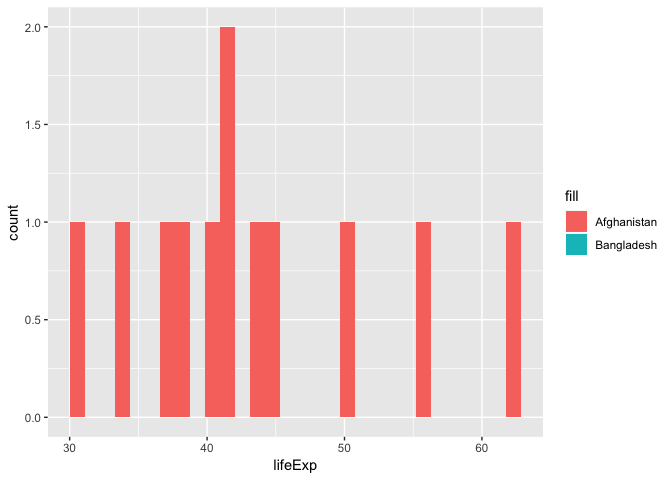

hw\_02\_Ninadh
================
Ninadh
September 25, 2018

``` r
library(gapminder)
library(tidyverse)
```

    ## ── Attaching packages ──────────────────────────────────────────────────────────────────────────── tidyverse 1.2.1 ──

    ## ✔ ggplot2 3.0.0     ✔ purrr   0.2.5
    ## ✔ tibble  1.4.2     ✔ dplyr   0.7.6
    ## ✔ tidyr   0.8.1     ✔ stringr 1.3.1
    ## ✔ readr   1.1.1     ✔ forcats 0.3.0

    ## ── Conflicts ─────────────────────────────────────────────────────────────────────────────── tidyverse_conflicts() ──
    ## ✖ dplyr::filter() masks stats::filter()
    ## ✖ dplyr::lag()    masks stats::lag()

``` r
library(ggplot2)
```

``` r
ggplot(gapminder, aes(x=continent, y=gdpPercap)) +
  geom_point()+
  scale_y_log10()
```



``` r
ggplot(gapminder, aes(x=lifeExp, y=gdpPercap)) +
  geom_point(alpha=0.5)+
  scale_y_log10()
```



``` r
ggplot(gapminder, aes(x=continent, y=gdpPercap)) +
  geom_point(alpha=0.2)+
  geom_boxplot(alpha=0.5)+
  scale_y_log10()
```



``` r
ggplot(gapminder, aes(gdpPercap)) +
  geom_histogram()+
  stat_bin(bins = 50)+
  scale_y_log10()
```

    ## `stat_bin()` using `bins = 30`. Pick better value with `binwidth`.

    ## Warning: Transformation introduced infinite values in continuous y-axis

    ## Warning: Transformation introduced infinite values in continuous y-axis

    ## Warning: Removed 11 rows containing missing values (geom_bar).

    ## Warning: Removed 23 rows containing missing values (geom_bar).



``` r
gapminder %>%
  filter(country=="Bangladesh") %>%
  ggplot(aes(lifeExp, gdpPercap))+
  geom_point()+
  geom_line()
```



``` r
gapminder %>%
  filter(country== c("Bangladesh", "Afghanistan"))
```

    ## # A tibble: 12 x 6
    ##    country     continent  year lifeExp       pop gdpPercap
    ##    <fct>       <fct>     <int>   <dbl>     <int>     <dbl>
    ##  1 Afghanistan Asia       1957    30.3   9240934      821.
    ##  2 Afghanistan Asia       1967    34.0  11537966      836.
    ##  3 Afghanistan Asia       1977    38.4  14880372      786.
    ##  4 Afghanistan Asia       1987    40.8  13867957      852.
    ##  5 Afghanistan Asia       1997    41.8  22227415      635.
    ##  6 Afghanistan Asia       2007    43.8  31889923      975.
    ##  7 Bangladesh  Asia       1952    37.5  46886859      684.
    ##  8 Bangladesh  Asia       1962    41.2  56839289      686.
    ##  9 Bangladesh  Asia       1972    45.3  70759295      630.
    ## 10 Bangladesh  Asia       1982    50.0  93074406      677.
    ## 11 Bangladesh  Asia       1992    56.0 113704579      838.
    ## 12 Bangladesh  Asia       2002    62.0 135656790     1136.

``` r
gapminder %>%
  filter(country== c("Bangladesh", "Afghanistan")) %>%
  ggplot(aes(lifeExp, year)) +
  geom_point(aes(fill="Bangladesh")) +
  geom_point(aes(fill="Afghanistan"))
```



``` r
gapminder %>%
  filter(country== c("Bangladesh", "Afghanistan")) %>%
  ggplot(aes(lifeExp))+
  geom_histogram()
```

    ## `stat_bin()` using `bins = 30`. Pick better value with `binwidth`.



``` r
gapminder %>%
  filter(country== c("Bangladesh", "Afghanistan")) %>%
  ggplot(aes(lifeExp))+
  geom_histogram(aes(fill="Bangladesh"))+
  geom_histogram(aes(fill="Afghanistan"))
```

    ## `stat_bin()` using `bins = 30`. Pick better value with `binwidth`.
    ## `stat_bin()` using `bins = 30`. Pick better value with `binwidth`.



R Markdown
----------

This is an R Markdown document. Markdown is a simple formatting syntax for authoring HTML, PDF, and MS Word documents. For more details on using R Markdown see <http://rmarkdown.rstudio.com>.

When you click the **Knit** button a document will be generated that includes both content as well as the output of any embedded R code chunks within the document. You can embed an R code chunk like this:

``` r
summary(cars)
```

    ##      speed           dist       
    ##  Min.   : 4.0   Min.   :  2.00  
    ##  1st Qu.:12.0   1st Qu.: 26.00  
    ##  Median :15.0   Median : 36.00  
    ##  Mean   :15.4   Mean   : 42.98  
    ##  3rd Qu.:19.0   3rd Qu.: 56.00  
    ##  Max.   :25.0   Max.   :120.00

Including Plots
---------------

You can also embed plots, for example:


Note that the `echo = FALSE` parameter was added to the code chunk to prevent printing of the R code that generated the plot.
